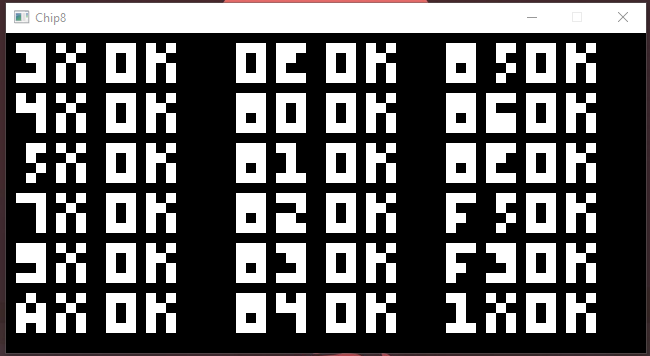

# Rusty Chip8

This is a straight forward Chip-8 emulator written in Rust. I am a relatively new Rust user so feedback on the emulator itself or my Rust code is welcome.

To build and run the emulator issue the following command:

```bash
cargo run --release
```
Note that you will need to source ROM files from the internet and you must acquire the appropriate SDL2 DLL for your system and place it beside the emulator binary -- see  [rust-sdl2 on Github](https://github.com/Rust-SDL2/rust-sdl2) for more details.

## Keypad Layout

The CHIP-8 has a 16-key keypad which I have mapped to the left-most end of the keyboard. This table shows the keymapping in the form CHIP-8 Key (Keyboard key), e.g. pressing W registers as key 0x5 on the emulator.

1 (1) | 2 (2) | 3 (3) | C (4)

4 (Q) | 5 (W) | 6 (E) | D (R)

7 (A) | 8 (S) | 9 (D) | E (F)

A (Z) | 0 (X) | B (C) | F (V)

## Project Organization
This project is split into the following files:

* main.rs - This is the entry point for the application; it instantiates the various components and maintains the CPU clock loop.
* cpu.rs - The CPU contains implementation for the fetch/decode/execute 'tick' as well as each opcode.
* screen.rs - The Screen contains data structures and methods for creating the game window and drawing to the screen as part of the DYXN operation.
* keypad.rs - The Keypad contains data structures and methods for receiving input from the 16-key keypad and checking the keypad state.
* audio.rs - The Audio module contains data structures and methods for generating the single-tone sound output.



